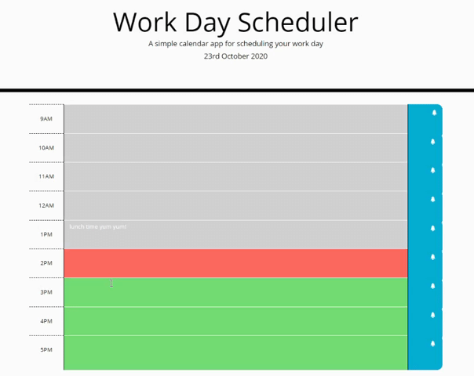

## Workday-Schedule-Page
A functional single-day-by-hour planner, colorcoded to reflect real time

## Link to Deployed Site

https://kcushing1.github.io/Workday-Schedule-Page/


## Demonstration

The application functionality:




## User Story

```
AS AN employee with a busy schedule
I WANT to add important events to a daily planner
SO THAT I can manage my time effectively
```


## Acceptance Criteria

```
GIVEN I am using a daily planner to create a schedule
WHEN I open the planner
THEN the current day is displayed at the top of the calendar
WHEN I scroll down
THEN I am presented with time blocks for standard business hours
WHEN I view the time blocks for that day
THEN each time block is color-coded to indicate whether it is in the past, present, or future
WHEN I click into a time block
THEN I can enter an event
WHEN I click the save button for that time block
THEN the text for that event is saved in local storage
WHEN I refresh the page
THEN the saved events persist
```

## Concepts Learned

It was interesting to think about the logics of time and time comparison within javascript and to use moment.js (although it seems the general opinion of the internet is that it is being phased out of use). I enjoyed using moment, and found it relatively straightforward to employ.

I also think I bettered my comfort using local storage, which is something I struggled with in the previous assignment. I found a post by br3t (see workscited.txt) that clicked my understanding.
